# PROJETO FINAL - WEARABLES - UM ESTUDO SOBRE A MELHORA NO DESEMPENHO METABÓLICO ATRAVÉS DA ANÁLISE DA QUEIMA DE CALORIAS E O AUMENTO GRADUAL DA ATIVIDADE FÍSICA

FINAL PROJECT - WEARABLES - A STUDY ON THE IMPROVING OF METABOLIC PERFORMANCE THROUGH THE ANALYSIS OF CALORIE BURNING AND THE GRADUAL INCREASE IN PHYSICAL ACTIVITY
==========================================
## Descrição do Projeto

Este projeto, desenvolvido para atender exclusivamente aos requisitos de entrega da disciplina IA386-X Ciência e Visualização de Dados em Saúde, tem o propósito de verificar se é possível predizer um aumento de performance metabólica do organismo de uma pessoa em função do aumento gradual da atividade física, através de dados obtidos de dispositivos vestíveis (wearables) da FITBIT.

Deste estudo foi possível encontrar uma relação entre a atividade física diária e a queima de calorias, destacando dois grupos distintos ao final da análise classificatória (por clusterização) e estatística (ANOVA) - o grupo dos sedentários (cujo desempenho não melhorou com a atividade física) e dos considerados ativos. 

Foram utilizados 2 conjuntos de dados, um para treinamento e outro para testes. O conjunto de dados de treinamento refere-se aos dados obtidos de voluntários entre 12 de Abril de 2016 e 13 de Maio de 2016. E o conjunto de dados de testes refere-se aos dados obtidos de voluntários entre 12 de Março de 2016 e 11 de Abril de 2016.

Embora os conjuntos de dados fossem pequenos, foi possível verificar através da análise do _Support Vector Machine_ (com uma acurácia de 94% de classificação dos indivíduos da base de dados de testes) e através da análise estatística do teste ANOVA dos dados clusterizados, que haviam de fato dois grupos distintos e que a classificação foi aceitável. Na ANOVA foram consideradas como hipóteses nula e alternativa as seguintes hipóteses:
* (H0): Não existem grupos com diferentes desempenhos metabóllicos em relação ao aumento da atividade física.
* (H1): Existe ao menos um grupo que apresenta desempenho metabólico diferente em relação a maior atividade física.

Entretanto, o conjunto de dados utilizado no estudo não foi suficiente para obter com maior precisão uma relação verdadeira entre aumento do desempenho metabólico com o aumento da atividade física. O grupo dos indivíduos "ativos" é composto de poucos registros e sua distribuição não é considerada normal em comparação ao grupo dos sedentários.

Após essas verificações e avaliações de classificação, foi realizada uma análise de covariância para as observações de peso e IMC dos indivíduos em relação ao consumo calórico. Como resultado, foi possível concluir que as variações no IMC e no peso (em Kg) foram significativas (dos indivíduos "ativos" e dos "sedentários"), mas a variância das observações de IMC ou Peso não foi suficiente para prever que, de fato, indivíduos ativos tiveram uma melhora no desempenho metabólico.

Como sugestão de continuidade do estudo, está a possibilidade de analisar a melhora da performance metabólica utilizando outras variáveis tais como: a intensidade da atividade física, maior volume de dados de BMI e de peso, calorias ingeridas, frequência cardíaca e consumo de oxigênio (VO2 e VO2 Max). E talvez essas variáveis permitissem outros tipos de análise, tal como a análise da redução de risco de doenças crônicas.

## Abstract

This project, developed to exclusively meet the delivery requirements of the IA386-X Health Data Science discipline, has the purpose of verifying whether there is a way to predict an increase in the metabolic performance of the person's organism due to the gradual increase in physical activity, through data obtained from FITBIT wearable devices.

In this study it was possible to find a relationship between daily physical activity and calorie burning, highlighting two distinct groups at the end of the classificatory and statistical analysis - the sedentary group and "active" individuals group. 

Two datasets were used in the study, the training dataset and the test dataser. The training dataset refers to data obtained from volunteers between 12 April 2016 and 13 May 2016. The test dataset refers to data obtained from volunteers between 12 March 2016 and 11 April 2016.

Although the datasets were small, it was possible to verify through the analysis of the _Support Vector Machine_ (with an accuracy of 94% of classification of the individuals in the test database) and through the statistical analysis of the ANOVA test of the clustered data, that there were in fact two different groups and that the classification was acceptable. In ANOVA, the following hypotheses were considered as null and alternative hypotheses: 
* (H0): There are no groups with different metabolic performance in relation to increased physical activity.
* (H1): There is at least one group that presents different metabolic performance in relation to increased physical activity.

The data set used in the study was not sufficient to more accurately obtain a true relationship between increased metabolic performance and increased physical activity. The group of "active" individuals is composed of few records and its distribution is not considered normal compared to the group of sedentary individuals.

After these verifications and the classification assessments, a covariance analysis was made for the individuals weight and BMI observations in relation to the caloric consumption. As a result, it was possible to conclude that the variation in BMI and Weight (in Kg) means were significant (of the "active"individuals and the "sedentary" individuals), but the observations variance of BMI or Weight were not enough to predict that, in fact, active individuals had an improvement in metabolic performance.

As a suggestion for continuing the study, is the possibility of analyzing the improvement in metabolic performance using other variables such as: the intensity of physical activity, greater volume of BMI and weight data, calories ingested, heart rate and oxygen consumption (VO2 and VO2 Max). And perhaps these variables would allow other types of analysis, such as the analysis of the risk reduction of chronic diseases.

## Equipe

A equipe do projeto é:
  Nome                  | Registro Acadêmico
:---------------------- | ------------------:
Guilherme Moraes Rosa   | 264437
Letícia Alves Ferreira  | 025809
Luiz Henrique Bonifacio | 264443

## Vídeo do Projeto
Para acessar o vídeo do projeto clique [aqui](https://drive.google.com/file/d/19nxuSKzZ3uiZspesl_oQ-H0cN66NkvWG/view?usp=sharing).

## Apresentação do Projeto

Para acessar a apresentação clique [aqui](https://docs.google.com/presentation/d/1PQfJYZzhF6Gi3-t6Lv9DQzBFzEvDtMS8KuEYQCKs1gc/edit?usp=sharing).

## Introdução e Motivação

Estudos recentes evidenciam que a falta de atividade física e hábitos de vida não saudáveis, como tabagismo, jornadas de trabalho excessivas, alcolismo, aumentam os riscos de aparecimento de outros problemas de saúde, tais como doenças crônicas, cardiovasculares, diabetes, câncer, etc.

De acordo com a [World Health Organization](https://www.who.int/news-room/fact-sheets/detail/the-top-10-causes-of-death), somente as doenças cardiovasculares correspondem a 31% das causas de morte no mundo todos os anos.

O aparecimento desses problemas de saúde levou à necessidade de medidas preventivas não somente por parte das seguradoras de saúde, como também das próprias pessoas, com o objetivo de melhorar os hábitos de vida, promovendo o bem estar e prevenindo o aparecimento de futuros problemas.

Com o avanço da tecnologia, tornando os sensores e dispositivos cada vez menores e mais precisos, com o surgimento da comunicação banda-larga e essa nova demanda pelos cuidados em saúde e bem estar, surgiram os dispositivos vestíveis (wearables), que são capazes de coletar informações fisiológicas e fornecer dados sobre a condição de saúde, tais como a frequência cardíaca, a saturação de oxigênio, a quantidade de passos percorridos e por quanto tempo, a qualidade do sono, entre outras informações.

Estas condições permitiram o surgimento de uma nova prática em medicina, conhecida como monitoramento remoto da saúde, em inglês _mobile Health_ (m-Health). 

Além disso, a previsão é que o mercado de Wearables cresça cerca de 15% ao ano, até 2023, de acordo com uma projeção da [Business Wire](https://www.businesswire.com/news/home/20190513005289/en). Diante desse cenário, e o surgimento do _m-Health_, estudos estão sendo conduzidoscom o objetivo de melhorar e aumentar o volume de informações apresentadas às pessoas, com base nos dados coletados dos dispositivos vestíveis.

Este estudo foi realizado utilizando determinados conjuntos desses dados coletados de dispositivos vestíveis da FITBIT (disponíveis para acesso livre na internet), e tem como objetivo entender se de fato uma mudança de hábitos, como um aumento / início de prática de atividade física, pode melhorar a saúde e o bem estar das pessoas, através da melhora do desempenho metabólico.

Esses dados oriundos do estudo da FITBIT são referentes ao período de Março de 2016 a Maio de 2016. Neste estudo, 33 indivíduos concordaram em submeter seus dados fisiológicos. Para cada indivíduo (representado por um identificador único), foram coletadas informações tais como quantidade de passos, a distância percorrida em 4 níveis de intensidade de atividade física (intensa, moderada, leve e sedentária), as calorias queimadas, a intensidade de exercício físico (intensa, moderada, leve e sedentária), o peso (em Kg), o IMC, o MET (Metabolic Equivalent), o período de tempo dormindo e período de tempo acordado, entre outras. 

> O Metabolic Equivalent (MET) é usado para estimar o gasto de energia para as atividades físicas comuns, sendo que **1** MET é a taxa metabólica de repouso (RMR) de um indivíduo, que **é aproximadamente 3,5 mililitros de oxigênio consumido por quilograma de peso corporal por minuto (mL / kg / min)** e representa a quantidade de oxigênio usada pelo corpo **em repouso**. Uma atividade com 4 METs, por exemplo, exige que o corpo use aproximadamente quatro vezes mais oxigênio do que quando está em repouso, o que significa que requer mais energia e queima mais **calorias**.

> Há estudos recentes em que é possível obter o MET com base na mensuração indireta do consumo calórico, através do consumo de oxigênio durante a atividade (em repouso ou em exercício), tais como o da [Scielo](https://www.scielo.br/pdf/rbme/v19n2/en_13.pdf).

> Para maiores informações a respeito do estudo da relação do MET com a atividade física e melhora nas condições de saúde recomenda-se a leitura do artigo [Atividade física e saúde: evolução dos conhecimentos, conceitos e recomendações para o clínico (Parte 1)](http://sociedades.cardiol.br/df/prod-cientifica/Artigo_BrasiliaMed-LuizAtividadefisica.pdf)

A sequencia de passos desde a análise de dados ao uso de metodologias não supervisionadas do estudo teve como umas das bases a metodologia de passos usada no artigo: ["Personalized Health Monitoring Using Predictive Analytics"](https://ieeexplore.ieee.org/document/8848236) da IEEE.

### Pergunta de Pesquisa

A pergunta de pesquisa está relacionada com a necessidade de se comprovar se a prática da atividade física promove uma melhora no metabolismo da pessoa, representada a princípio através das variações do aumento do consumo calórico versus perda de peso ou melhora do IMC (índice de massa corporal).

Dessa forma a pergunta de pesquisa foi: Há de fato uma melhora no desempenho metabólico com o aumento gradual da atividade física? 

### Objetivos do Projeto

Dentre os objetivos do projeto estão:
- Analisar os dados para verificar uma possível correlação entre consumo metabólico (representado pelas calorias e pelo MET) e as atividades físicas (de leve a moderadas);
- Análise dos dados, após verificar quais variáveis apresentavam maior correlação, para também correlacionar com as informações de peso e IMC (ou BMI - sigla em inglês para _Body Mass Index_);
- Classificar os indivíduos conforme seu ganho de performance e conforme sua performance resultante e;
- Concluir se de fato haveria ou não um aumento no desempenho metabólico e que fosse significativo com base nessa classificação e nos resultados das correlações entre Peso e BMI x Calorias dos dados classificados.

No estudo desse projeto foram consolidadas em uma tabela as informações diárias referentes à distância percorrida conforme o grau de intensidade da atividade física, o tempo gasto em atividades físicas (intensa, moderada, leve e sedentária), o consumo calórico, os equivalentes metabólicos e o total de passos percorridos. 

Outras informações, embora relevantes, não foram utilizadas para todas as observações por não estarem disponíveis para todos os indivíduos, como os valores de peso, IMC e índice de gordura corporal. Esses valores eram poucos ou faltantes na maioria das observações pois os indivíduos participantes dessa pesquisa da FITBIT não possuíam o mesmo tipo de dispositivo e dessa forma algumas observações (dados) estão ausentes ou inconsistentes.

## Recursos e Métodos

### Base de Dados

Base de Dados | Endereço na Web | Resumo Descritivo e Uso
------------ | ------------- | -------------------------
Zenodo - Crowd-sourced Fitbit datasets 03.12.2016-04.11.2016 | https://zenodo.org/record/53894/files/mturkfitbit_export_3.12.16-4.11.16.zip?download=1 | Base de dados utilizada como dados de testes, para verificar se a classificação pela clusterização K-means de duas variáveis foi o suficiente.
 Zenodo - Crowd-sourced Fitbit datasets 04.12.2016-05.12.2016| https://zenodo.org/record/53894/files/mturkfitbit_export_4.12.16-5.12.16.zip?download=1 | Base de dados utilizada como dados de treinamento, para realizar a classificação pela clusterização K-means com duas variáveis (% de tempo ativo e % de distância percorrida quando em atividade física).

## Ferramentas

Ferramenta | Endereço na Web | Resumo descritivo e uso
---------- | -- | -----------------------
SAS University Edition | https://www.sas.com/pt_br/software/university-edition.html | Ferramenta utilizada para extração dos atributos das bases de dados da FITBIT e consolidação em um conjunto de dados somente. Utilizada também nas análises de correlação, ANOVA, R-Squared, distribuição dos dados consolidados e dos dados após classificação.
Python - Google Colab - Notebook Jupyter | https://github.com/leticia-alves-ferreira/Projeto-Atividade-Fisica-IA-386-X/blob/master/notebooks/Fitbit_an%C3%A1lise_1.ipynb | Ferramenta utilizada para preparação dos dados consolidados para aplicação dos algoritmos de classificação e clusterização. Utilizado também para a representação gráfica dos resultados.

# Metodologia

Para a realização deste trabalho, foram adotadas técnicas de aprendizado de máquina e análise estatística, combinadas de maneira complementar. 

Uma vez que o conjunto de dados adotado não possui nenhuma variável categórica, decidiu-se utilizar um algoritmo de clusterização para que fosse possível dividir as amostras analisadas em dois grupos distintos, o grupo dos indivíduos considerados sedentários e o grupo dos indivíduos considerados ativos. Com essa nova divisão, foi possível aplicar a técnica de análise estatística ANOVA (Análise de Variância) com o objetivo de explicitar as relações existentes entre os conjuntos analisados. 

Utilizando um algoritmo de classificação aplicado a um conjunto de dados diferente daquele utilizado no algoritmo de clusterização, verificou-se que as amostras foram classificadas nos dois grupos de interesse com uma boa precisão.

Por fim, foi analisado se os dados resultantes dessa classificação eram considerados normais para que fosse aplicada uma análise de variância nas observações que continham informações como Peso (em Kg) e BMI, a fim de responder à pergunta da pesquisa.

## Detalhamento do projeto

Na realização do estudo foi necessário extrair as informações das tabelas de dados da FITBIT e consolidá-las em uma tabela de dados única. 

Após esta consolidação, foram realizadas análises e ajustes neste conjunto de dados para implementação dos algoritmos de clusterização e classificação e posterior análise estatística dos dados resultantes. 

A seguir, são apresentadas as etapas realizadas.

### Análise Exploratória do Conjunto de Dados

A base de dados utilizada neste trabalho é formada por informações capturadas de 33 indivíduos através dos dispositivos wearables da fabricante Fitbit, que durante um período médio de 30 dias, concordaram em fornecer esses dados, registrando manualmente as informações em formulários.

Como nem todos os índivíduos possuiam o mesmo tipo de dispositivo wearable, há uma discrepância entre os dados coletados, uma vez que alguns dispositivos não eram capazes de fornecer todas as informações consideradas.

Conforme mencionado anteriormente, para cada indivíduo (representado por um identificador único), foram coletadas informações como quantidade diária de passos, distância percorrida nos diferentes níveis de atividade física, as calorias diárias queimadas, o tempo gasto diariamente nas atividades físicas, conforme seu grau de intensidade, o peso, o IMC e informações de MET (do inglês, _Metabolic Equivalent of Task_) - que é uma taxa que indica qual o gasto energético de um indivíduo, comparada com um valor de base, definido como o valor equivalente consumido quando uma pessoa está sentada/sedentária. 

Após serem estabelecidas as variaveis de interesse, formou-se uma base de dados composta por 940 observações e 15 atributos. Cada observação representa uma amostra diária de cada um dos 15 atributos catalogados. 

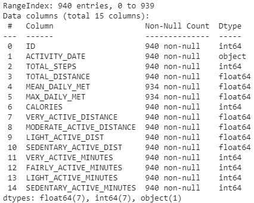

[Clique aqui para acessar o Notebook Jupyter do Estudo](https://github.com/leticia-alves-ferreira/Projeto-Atividade-Fisica-IA-386-X/blob/master/notebooks/Fitbit_an%C3%A1lise_1.ipynb "Notebook Jupyter do projeto")

Após definidas as informações de interesse, foram utilizadas técnicas de Análise Exploratória de Dados ou EDA (Exploratory Data Analysis) para obter um conhecimento mais profundo do conjunto de dados, verificar suas estatísticas descritivas, analisar correlações entre seus atributos e extrair informações úteis. Esta análise foi realizada utilizando a linguagem Python e a biblioteca Pandas. 

### Limpeza de Dados

Os conjuntos de dados brutos geralmente possuem muitas partes irrelevantes ou ausentes e não estão ainda viáveis para uma análise. Para lidar com esta situação, a limpeza de dados é essencial. Ela envolve o manuseio e/ou preenchimento de dados ausentes, redução de ruídos, identificação e remoção de valores aberrantes e a resolução de inconsistências.

Para o conjunto de dados utilizado neste trabalho, alguns cenários problemáticos foram encontrados. Foi constatada a ausência de valores para 6 células de diferentes indivíduos, para diferentes atributos. Para corrigir este problema, os valores ausentes foram preenchidos com os valores referentes ao dia anterior correspondente ao mesmo indivíduo no conjunto de dados.

Por meio da análise exploratória, também foram constatados diversos valores inconsistentes ou muito distantes dos valores médios. Estes valores podem ser oriundos de erros humanos durante o preenchimento dos formulários ou mesmo problemas técnicos dos dispositivos wearables, entre outras situações. 

Para corrigir este tipo de problema, foram utilizadas diferentes abordagens:
  * Substituição de valores nulos por valores coletados no dia anterior, uma vez que uma quantidade considerável de exemplos apresentavam valores nulos.
  * Exclusão de valores inconsistentes. Em alguns casos, valores do atributo 'CALORIES' eram inconsistentes com o gasto calórico médio diário de um indivduo adulto saudável. Considera-se que para um homem adulto de 70 kg e 1.80 metros de altura, este valor está em torno de 1.721 calorias de metabolismo basal. Já para uma mulher adulta de 55 kg e 1.60 metros de altura, o valor é de 1.330 calorias. No conjunto de dados foram exlcuídos 10 exemplos com valores abaixo de 1110.
  * Exclusão ou substituição de valores inconsistentes em relação ao atributo 'TOTAL_ACTIVE_MINUTES'. O valor da soma dos minutos de um dia é igual a 1440. Valores muito distantes do valor esperado foram substituídos, quando acima e removidos quando abaixo. 
 * Exlusão de valores do atributo 'TOTAL_STEPS' com valores menores do que 100 passos, por se tratar de valores minimamente significantes. Foram removidos 29 exemplos.
 
### Engenharia de Atributos

Consiste no processo de utilizar o conhecimento sobre os dados para transformar e criar novos atributos - basicamente são dados gerados a partir de dados previamente coletados - com o objetivo de treinar modelos de aprendizado de máquinas que desempenhem seu papel de maneira mais eficiente.

Nesse estudo a engenharia de atributos foi realizada utilizando a biblioteca Pandas. Foram criados novos atributos a partir dos atributos disponíveis no conjunto de dados. Os novos atributos são:

  * 'TOTAL_ACTIVE_MINUTES': a partir da soma das colunas 'VERY_ACTIVE_MINUTES', 'FAIRLY_ACTIVE_MINUTES', 'LIGHT_ACTIVE_MINUTES', 'SEDENTARY_ACTIVE_MINUTES'. 
  * 'TOTAL_ACTIVE_DISTANCE': a partir da soma das colunas 'VERY_ACTIVE_DISTANCE', 'FAIRLY_ACTIVE_DISTANCE', 'LIGHT_ACTIVE_DISTANCE', 'SEDENTARY_ACTIVE_DISTANCE'.
  * '%_ACTIVE_MINUTES': a partir da divisão da coluna 'VERY_ACTIVE_MINUTES' pela coluna 'TOTAL_ACTIVE_MINUTES'.  
  * '%_ACTIVE_DISTANCE': a partir da divisão da coluna 'VERY_ACTIVE_DISTANCE' pela coluna 'TOTAL_ACTIVE_DISTANCE'.   

### Seleção de atributos

Consiste no processo de seleção, de maneira automática ou manual, dos recursos que mais contribuem para sua variável de previsão ou saída de interesse. Atributos irrelevantes no conjunto de dados podem prejudicar o processo de aprendizado e diminuir a eficácia dos modelos. 

Foram realizadas 3 seleções de atributos, duas para as clusterizações com o algoritmo k-means e uma para o treinamento do classificador utilizando o algoritmo Support Vector Machines.
  *   Foram selecionados os atributos '%_ACTIVE_MINUTES' e '%_ACTIVE_DISTANCE' para a primeira clusterização. Os atributos foram selecionados manualmente, em conjunto de uma análise de correlações realizada na etapa de EDA. Foram selecionados apenas 2 atributos por motivos de visualização.  
  *   Foram selecionados os atributos '%_ACTIVE_MINUTES', '%_ACTIVE_DISTANCE' e 'CALORIES' para a segunda clusterização. Os atributos foram selecionados manualmente, em conjunto de uma análise de correlações realizada na etapa de EDA. Foram selecionados apenas 3 atributos por motivos de visualização.
  *   Foram selecionados os atributos 'TOTAL_STEPS', 'TOTAL_DISTANCE', 'MEAN_DAILY_MET', 'MAX_DAILY_MET', 'CALORIES', 'VERY_ACTIVE_DISTANCE' 'MODERATE_ACTIVE_DISTANCE', 'LIGHT_ACTIVE_DIST','SEDENTARY_ACTIVE_DIST', 'VERY_ACTIVE_MINUTES', 'FAIRLY_ACTIVE_MINUTES', 'LIGHT_ACTIVE_MINUTES', 'SEDENTARY_ACTIVE_MINUTES', 'TOTAL_ACTIVE_MINUTES', 'TOTAL_ACTIVE_DISTANCE', '%_ACTIVE_MINUTES' e '%_ACTIVE_DISTANCE' para o treinamento do classificador. 

### Clusterização
  
Clusterização consiste na tarefa de agrupar um conjunto de dados de forma que os exemplos no mesmo grupo (chamado cluster) sejam mais semelhantes entre si do que os de outros grupos (clusters). É um exemplo de aprendizado não supervisionado. 

Com o intuito de separar os indivíduos presentes na base de dados em dois grupos distintos, sedentários e ativos, realizamos duas clusterizações utilizando os atributos citados na seção anterior. 
* Primeiro, foi calculado o valor médio de cada atributo para cada indivíduo separadamente;
* Na sequência os atributos relevantes foram separados e dois modelos foram treinados utilizando-se o algoritmo k-means da biblioteca Scikit-Learn.

### SVM - _Support Vector Machines_

Utilizamos os rótulos gerados pela clusterização da etapa anterior para treinar um classificador com o intuito de classificar novos indivíduos em um dos grupos criados. 

As classes foram balanceadas, os atributos foram normalizados apropriadamente e os dados foram separados em conjuntos de treinamento e teste. Através da biblioteca Scikit-Learn, um classificador SVM foi treinado no conjunto de dados de coletas diárias e uma acurácia de **94%** foi obtida no conjunto de testes.

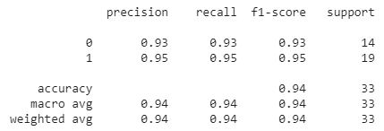

## Evolução do Projeto

Durante a execução das etapas anteriormente descritas foram encontrados problemas em relação ao conjunto de dados utilizado e, consesquentemente, algumas decisões de projeto foram avaliadas e adotadas, de forma a garantir que os objetivos propostos fossem alcançados. 

Inicialmente, a ideia principal se concentrava em explorar as possíveis relações existentes entre as informações relacionadas a peso, IMC e gordura corporal dos indivíduos com as variáveis que indicam o deslocamento e a intensidade de exercício físico. Contudo, como a etapa de análise exploratória apontou uma consideravel incosistência nestes dados, decidiu-se por abandonar esse tipo de análise. A partir disso, utilizando uma análise de correlação entre todas as variáveis do conjunto de dados, foi verificada uma forte correlação entre as variáveis de distância de deslocamento e alta intensidade de exercício físico com as variáveis de gasto calórico e MET. 

Baseado nessa observação, essas variáveis com maior potencial de correlação foram utilizadas no algoritmo de clusterização. Inicialmente, considerou-se a clusterização em relação à queima total diária de calorias. Entretanto, esse valor total de queima diária de calorias é um valor consolidado, ou seja, sem discriminações em relação ao tipo de atividade praticada (desde atividade mais intensa - _VERY_ACTIVE_ - ao sedentarismo) no intervalo de um dia. Por esse motivo essa abordagem foi descartada. O mesmo se aplica à variável MET, em que havia somente o valor médio do equivalente metabólico e o valor máximo. 

Decidiu-se então realizar a clusterização em função das variáveis '%_ACTIVE_MINUTES' e '%_ACTIVE_DISTANCE'. Conforme discutido anteriormente, essas variáveis representam, para cada indivíduo na base de dados, as relações entre:
* o tempo gasto em atividades de alta intensidade x o tempo total gasto em todas as atividades (até as sedentárias) e;
* a distância percorrida em atividades de alta intensidade x a distância total percorrida em todas as atividades (até as sedentárias). 

Após a clusterização da tabela de dados consolidada e da tabela de dados com as médias das observações, foram obtidos dois grupos denominados no estudo como _Sedentários_ e _Ativos_. 

Segue a análise de distribuição normal realizada nos dados da tabela das observações consolidadas após executado o algoritmo Cluster K-means:

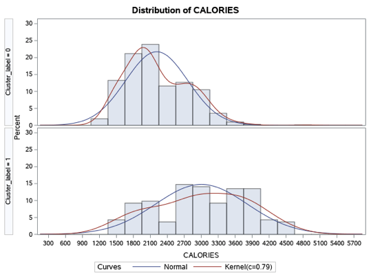

Para o grupo representando o cluster dos sedentários, na tabela que contém os valores das médias dos atributos das observações, segue a análise da distribuição normal dos dados:
 
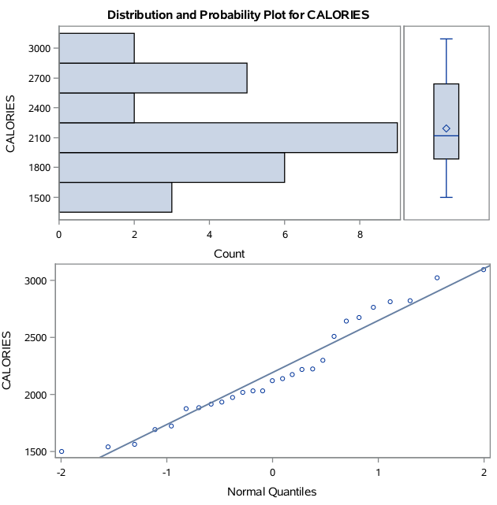

É possível notar que embora o número de amostras seja baixo, a distribuição observada é muito próxima de uma distribuição normal.

No entanto, essa mesma análise para o cluster dos indivíduos classificados como ativos, conforme a seguir:

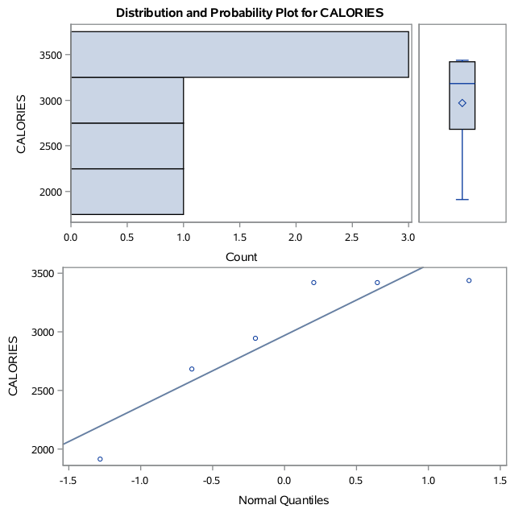

É difícil inferir conclusões ao observar a distribuição, uma vez que a quantidade de amostras pode ser considerada insuficiente.

Na análise de variância, foi obtido um p-valor de 0.0012. A distribuição para os dois grupos é expressa como:

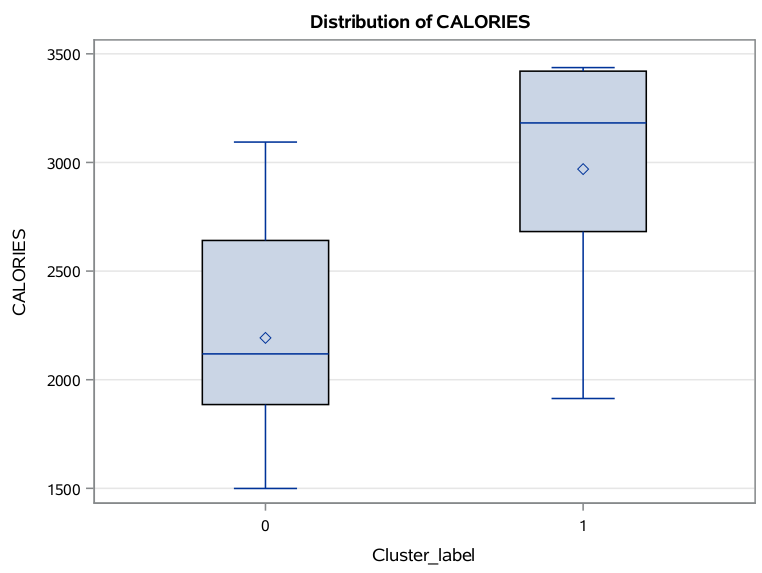

É possível perceber que a distância entre os valores médios para ambos os grupos é superior a 500 calorias. Essa diferença torna expícita a diferença de consumo energético entre os indivíduos de cada grupo. 

# Resultados e Discussão

### Clusterização

Após realizar as clusterizações, analisou-se o valor médio dos atributos em cada cluster, que indicou que o resultado do processo de clusterização realmente representa dois grupos distintos, sendo o primeiro composto por pessoas mais ativas e o segundo composto por pessoas mais sedentárias.

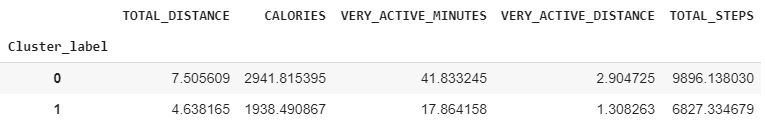

A tabela abaixo apresenta o desvio padrão dos atributos de cada cluster, investigando a tabela e o gráfico abaixo, apesar do número reduzido de amostras para o grupo dos ativos, podemos notar que o grupo dos sedentários é mais homogêneo em relação ao outro grupo. O conjunto de indivíduos ativos varia desde indivíduos bastante ativos até outros mais próximos em relação aos sedentários.  

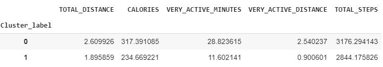

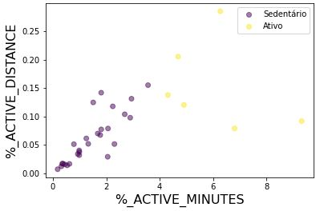

### _Support Vector Machines_(SVM)

A inferência foi realizada em 2 indivíduos da base de dados de teste, que não se encontravam no conjunto de dados de treinamento. O algoritmo SVM classificou ambos como pertencentes ao grupo dos sedentários. 

Entretanto, para ter certeza da eficácia da classificação, os gráficos plotados anteriormente após as clusterizações foram novamente plotados, incluindo agora um dos indivíduos que foram classificados pelo SVM. É possível verificar que houve consistência na classificação, realizada pelo SVM, deste novo indivíduo posicionado próximo aos outros indivíduos sedentários, após uma análise das suas informações na tabela consolidada, segundo os parâmetros da clusterização.

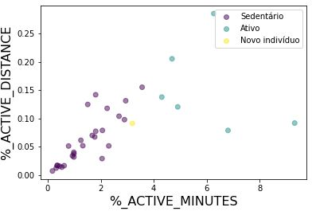

### ANOVA

Como uma segunda forma de verificação da eficácia da clusterização, foi utilizada a análise de variância (ANOVA), considerando um p-valor >= 0.05 e as seguintes hipóteses:
* (H0): Não existem grupos com diferentes desempenhos metabóllicos em relação ao aumento da atividade física.
* (H1): Existe ao menos um grupo que apresenta desempenho metabólico diferente em relação a maior atividade física.

Analisando o box plot resultante da ANOVA foi possível verificar, devido a diferença entre os valores médios das duas distribuições, que haviam dois grupos distintos. O resultado obtido nesta etapa serviu como validação para o resultado da clusterização, com um p-valor menor que 0.001, de forma a rejeitar a hipótese nula.

## Análise de Covariância

A fim de finalmente responder à pergunta de pesquisa foi realizada a análise de covariância nos dois indivíduos que possuíam informações de peso e BMI mínimas, com o objetivo de verificar se houve melhora da performance metabólica dada uma certa atividade física.

Foi observado que se travavam de indivíduos que estavam classificados em grupos diferentes e que apresentavam conjuntos distintos de BMI. Nesta análise foi verificada a variação na queima de calorias em relação às variações do BMI para o indivíduo ativo e o indivíduo classificado como sedentário:
* Do individuo considerado ativo era maior o consumo calórico com maiores minutos em alta atividade, mas sem significativa variação do BMI;
* Do indivíduo considerado sedentário era menor o consumo calórico com menores minutos em alta atividade e sem significativa variação do BMI.

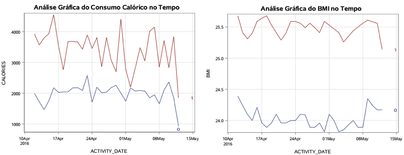

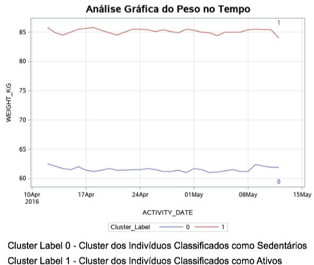 

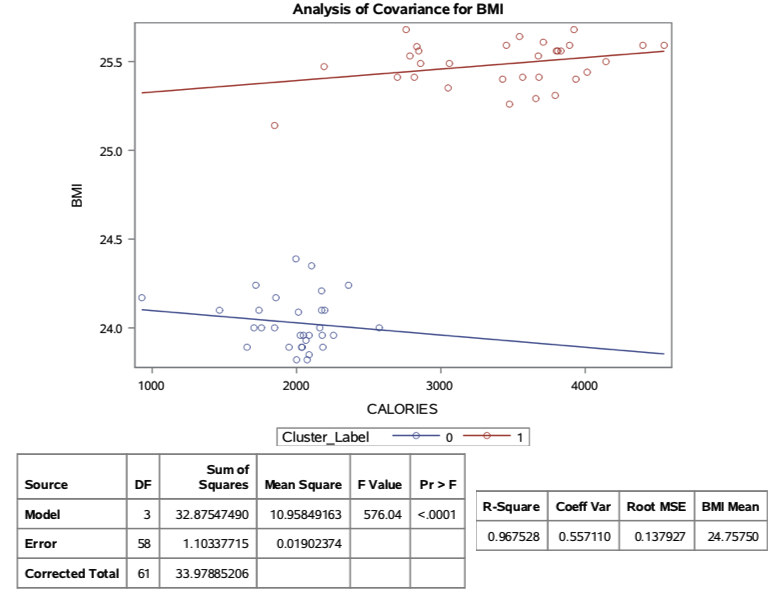

Foi possível perceber com essa análise que o aumento do consumo calórico no indivíduo considerado ativo provocou leve queda do BMI, mas não expressiva o suficiente para confirmar que o aumento do consumo calórico em função da prática de atividade física levou a uma melhora significativa da performance metabólica.

Também foi possível perceber que o baixo consumo calórico do indivíduo sedentário praticamente não variou o BMI, ou seja, não foi o suficiente para confirmar que o baixo consumo calórico em função do sedentarismo levou a uma piora da performance metabólica, somente manteve estável.

# Conclusões

Este estudo tinha como objetivo realizar algumas inferências sobre à melhora no desempenho metabólico em relação ao aumento da atividade física. 

Durante a evolução do projeto foi verificado que haviam poucas observações que continham as informações relevantes, como as informações diárias de peso (em Kg) e BMI dos indivíduos, para aprofundar o estudo. Haviam somente dois indivíduos da base de dados que continham observações em quantidade suficiente para realizar uma análise temporal de melhora da performance metabolica X execução de atividades físicas mais intensas.

Com base nas classificações realizadas pelo algoritmo de clusterização (indivíduo sedentário / ativo), verificadas através do SVM e do ANOVA, foi realizado um estudo de correlações e covariâncias entre essas observações, analisando as variações de peso, representadas por **Weight_Kg** e as variações de **BMI** em relação ao consumo calórico (**Calories**) diário.

O resultado dessas análises foram:
* coeficientes de correlação de negativos entre **Calories x Weight_Kg** e **Calories x BMI** de -0.125 e -0.136, respectivamente, para o indivíduo classificado como sedentário - correlação negtiva - maior consumo calórico menor o peso - e;
* coeficiente de correlação positivos de **Calories x Weight_Kg** e **Calories x BMI** de 0.3201 e 0.3159, respectivamente, para o indivíduo classificado como ativo - correlação positiva - indica que não somente a atividade física mais regular e mais intensa melhoraria a perormance metabólica.

Levando à conclusão (com base nesses dados) de que não necessariamente o aumento da atividade física melhora a performance meabólica no tempo, pois as correlações entre **Calories x Weight_Kg** e **Calories x BMI** não eram significativas o suficiente. 

# Trabalhos Futuros

Como sugestão de continuidade do estudo, está a possibilidade de analisar a melhora do desempenho metabólico versus o aumento gradual da atividade física e a consequente perda de peso utilizando outras variáveis para análise e um maior número de observações (ao menos 90 observações diárias pra cada indivíduo e ao menos 40 indivíduos). 

Dentre as variáveis de análise é possível citar: gênero do indivíduo (masculino/feminino), o consumo de oxigênio basal, o consumo máximo de oxigênio, a pressão sanguínea, os batimentos cardíacos e as comorbidades (como diabetes).

Com base em tais variáveis e em parâmetros já pré-estabelecidos pela comunidade médica (principalmente pela American Medical Association e WHO) sugere-se também realizar uma análise da redução de risco de doenças crônicas (como cardiopáticas, infarto agudo do miocárdio, aterosclerose, entre outras) com o aumento da atividade física.
