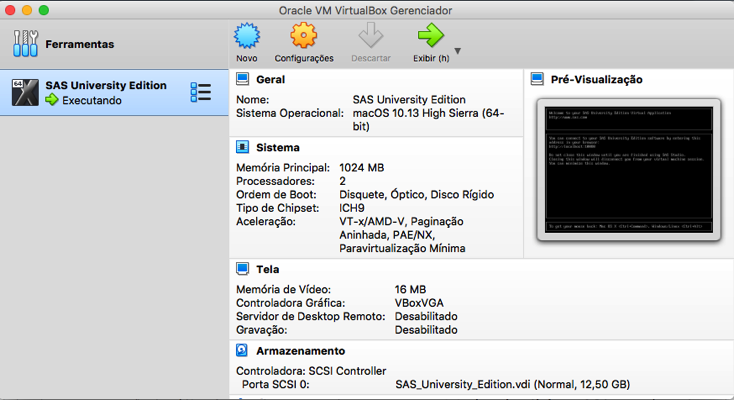
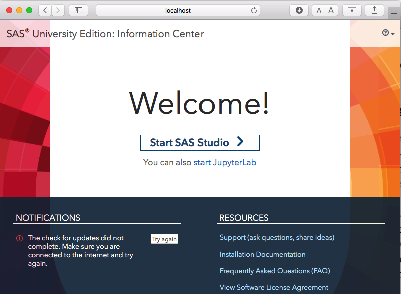
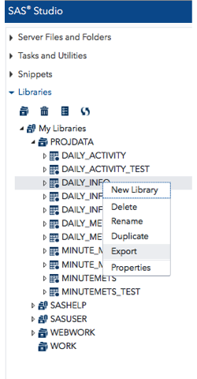

# INSTRUÇÕES DE INSTALAÇÃO

## SAS

Para que seja possível rodar o código fonte do SAS na máquina local, primeiramente é necessário seguir o passo a passo de instalação que se encontra no link de download do SAS University Edition.

* Instruções de Download e instalação para [MAC OS X](https://www.sas.com/pt_br/software/university-edition/download-software.html#mac-os-x).
* Instruções de Download e instalação para [Windows](https://www.sas.com/pt_br/software/university-edition/download-software.html#windows).
* Instruções de Download e instalação para [LINUX](https://www.sas.com/pt_br/software/university-edition/download-software.html#linux).

Esse passo a passo vai mostrar como instalar o **_Oracle Virtual Machine_**, pois o SAS executa como uma máquina virtual através do **_Oracle Virtual Machine_**. 

Posteriormente, após finalizado o processo de instalação, para acessar o _SAS Studio_ é preciso executar a máquina virtual do _SAS University Edition_. 

Após iniciada a máquina virtual, é somente iniciar a máquina virtual e, no browser,  entrar na URL: "http://localhost:10080/"

E clicar em **_Start SAS Studio_**.

Após entrar no SAS Studio, os arquivos fonte dentro da pasta **/src/SAS/** devem ser copiados para a pasta **../SASUniversityEdition/myfolders/src**. 

A pasta que contém os arquivos de teste é **data/raw/mturkfitbit_export_3.12.16-4.11.16/Fitabase Data 3.12.16-4.11.16/** e a pasta que contém os arquivos para treinamento é **data/raw/mturkfitbit_export_4.12.16-5.12.16/Fitabase Data 4.12.16-5.12.16/**. 

Na pasta **../SASUniversityEdition/myfolders/dataset/** criar a pasta **Treinamento** e a pasta **Teste**. Então copie e cole o conteúdo da pasta **data/raw/mturkfitbit_export_3.12.16-4.11.16/Fitabase Data 3.12.16-4.11.16/** na pasta **Teste** e o conteúdo da pasta **data/raw/mturkfitbit_export_4.12.16-5.12.16/Fitabase Data 4.12.16-5.12.16/** na pasta **Treinamento**. 

Para armazenar as tabelas que são criadas durante a execução do código fonte é preciso criar dentro da pasta "../SASUniversityEdition/myfolders/" a pasta **Bibliotecas**  ==>  ../SASUniversityEdition/myfolders/**Bibliotecas**/. 

Deve ser armazenado todo o conteúdo da pasta ../data/processed/**Cluster Data** deste repositório, na pasta ../SASUniversityEdition/myfolders/**Bibliotecas/Cluster Data/**.

Para extrair, no SAS Studio, os arquivos _DAILY_INFORMATION.csv_ e _DAILY_INFO_TEST.csv_ (disponibilizados na pasta **data/interim/** desse repositório) é preciso:
* Executar os programas _"Projeto_Atividade_Fisica_Dados_Treinamento.sas"_ e _"Projeto_Atividade_Fisica_Dados_Teste.sas"_ dentro da pasta **../SASUniversityEdition/myfolders/src/** para que sejam criados os dados consolidados do estudo. 
* Entrar na pasta LIBRARIES -> PROJDATA e selecionar a tabela que se deseja exportar para um arquivo no formato ".csv", conforme ilustrado a seguir.

